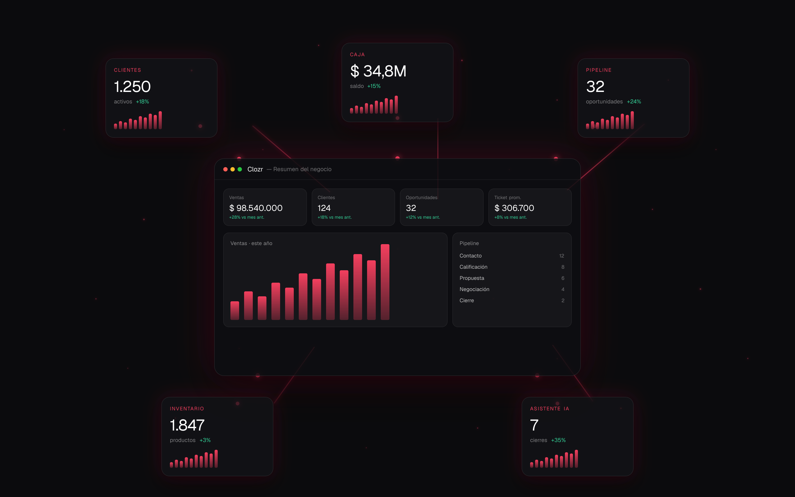

<p align="center">
  
</p>

# Clozr

CRM de escritorio para emprendedores y pequeños negocios. Multi-empresa, multi-usuario,
con tracking de ventas, pipeline, cobros, caja dual ARS/USD y reportes.

Construido en **Tauri 2 + React 18 + TypeScript** con **SQLite local** (default) y
**Turso/libSQL en la nube** para equipos que quieren colaborar en tiempo casi-real.
Auto-update vía GitHub Releases firmados.

---

## Stack

- **Frontend**: React 18 · TypeScript 5 · Vite 6 · Inter Variable · Lucide
- **State**: Zustand · TanStack Query
- **Forms**: React Hook Form · Zod
- **Drag & drop**: @dnd-kit (Pipeline kanban)
- **Backend desktop**: Tauri 2 (Rust)
- **DB local**: SQLite (con `tauri-plugin-sql`)
- **Backend cloud** (opcional): Cloudflare Worker + Turso (libSQL)
- **Auth cloud**: Magic-link via Resend + JWT HS256
- **Tests**: Vitest

Sin Tailwind. Estilos vía CSS variables tipadas (`src/tokens/`).

### Arquitectura local ↔ cloud

La app funciona en **dos modos** simultáneos por feature:

- **Local-only** (default): todos los datos viven en SQLite. Cero red.
- **Cloud-enabled** (por feature): cuando el owner activa una feature
  desde Ajustes → Datos en la nube, las queries de esa feature van a
  Turso vía el Worker. El SQLite queda como cache local.

Cada `src/lib/db/*.ts` dispatcha vía un helper `cloudCtx()` que devuelve
config si la feature está en modo cloud para el workspace activo.
Polling adaptativo (5s activo / 30s idle) mantiene "casi real-time"
sin saturar Turso.

Permisos: matriz centralizada en `src/lib/permissions.ts`, consumida
tanto por frontend (`can()`) como por el worker (mismo file via
relative import) — un solo source of truth.

---

## Pantallas

| Pantalla | Estado |
|----------|--------|
| **Mi Día** | Dashboard del vendedor con tareas, seguimientos, cobros pendientes, ventas hoy, clientes inactivos, score |
| **Pipeline** | Kanban de 7 etapas con drag & drop persistido |
| **Clientes** | Tabla filtrable + detalle drawer con timeline + crear/editar/eliminar/exportar |
| **Ventas** | Tabla + métricas + sparkline 30d + crear venta + marcar pagada |
| **Caja** | Balance dual ARS/USD del día + lista de movimientos + crear movimiento |
| **Tareas** | Lista filtrable con checkbox optimista |
| **Deudas** | Vista cross-cliente con bulk cobrar |
| **Reportes** | Métricas, top clientes, top vendedores, bar chart 6 meses |
| **Equipo** | Gestión de miembros con roles |
| **Ajustes** | Workspace, perfil, pipeline, tipos de cliente, catálogo, datos |

Plus: **Cmd+K** para búsqueda global, **`?`** para ver atajos, **dropdown "+ Nuevo"** en topbar.

---

## Atajos de teclado

```
Acciones rápidas:        Navegación:
  V  Nueva venta           1  Mi Día
  C  Nuevo cliente         2  Pipeline
  M  Nuevo movimiento      3  Clientes
  T  Nueva tarea           4  Ventas
  L  Ir a pipeline         5  Caja
                           6  Deudas
General:                   7  Inventario
  ⌘K  Búsqueda global      8  Tareas
  ?   Mostrar shortcuts    9  Reportes
  Esc Cerrar diálogos
```

---

## Desarrollo

### Requisitos

- Node 20+
- Rust stable + tooling de Tauri 2 ([guía oficial](https://tauri.app/start/prerequisites/))
- Windows: Visual Studio Build Tools con C++ workload + Windows SDK

### Setup

```bash
npm install
npm run tauri dev
```

### Comandos

| Comando | Qué hace |
|---------|----------|
| `npm run dev` | Vite dev server (frontend solo) |
| `npm run tauri dev` | Tauri + Vite, con hot reload |
| `npm run build` | Typecheck + build frontend (no compila Rust) |
| `npm run tauri build` | Build completo (genera instaladores `.exe` / `.msi` / `.dmg` / `.deb`) |
| `npm test` | Tests unitarios (mappers, format, groupings) |
| `npm run test:watch` | Vitest watch mode |
| `npm run lint` | ESLint |
| `npm run format` | Prettier |

---

## Releases

Tagging un commit con `vX.Y.Z` dispara GitHub Actions que:
1. Compila para Windows / macOS Intel / macOS Apple Silicon / Linux
2. Firma los instaladores (necesita secrets `TAURI_SIGNING_PRIVATE_KEY` + password)
3. Publica un GitHub Release con `latest.json`
4. Las apps instaladas detectan el update y muestran banner para actualizar

```bash
# Bump version en src-tauri/tauri.conf.json
git add -A && git commit -m "feat: ..."
git tag v1.0.0
git push && git push origin v1.0.0
```

---

## Documentación adicional

- [`docs/ARCHITECTURE.md`](docs/ARCHITECTURE.md) — layout del repo, reglas de oro, cómo agregar features
- [`ONBOARDING.md`](ONBOARDING.md) — setup paso-a-paso para nuevos developers
- [`cf-worker/README.md`](cf-worker/README.md) — endpoints, secrets y deploy del Worker
- [`CHANGELOG.md`](CHANGELOG.md) — historial de versiones
